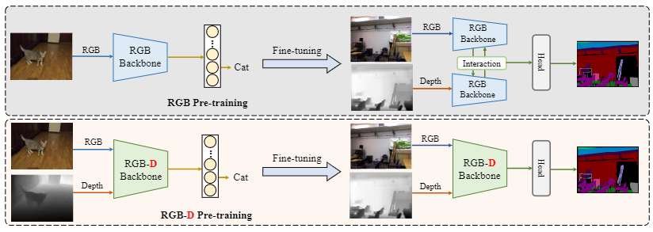
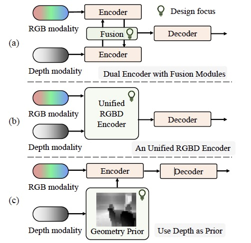
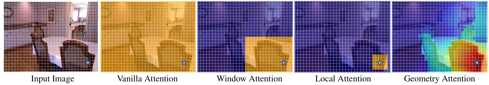
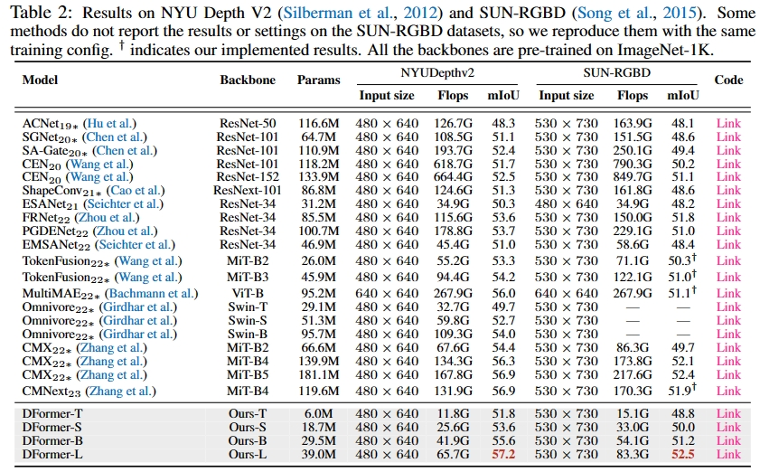
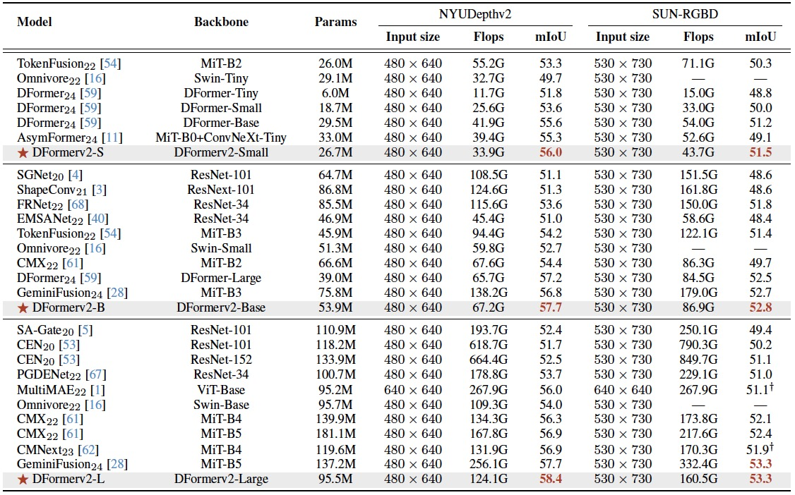

# <p align=center>`DFormer for RGBD Semantic Segmentation`</p>


This repository contains the official implementation of the following papers:

> DFormer: Rethinking RGBD Representation Learning for Semantic Segmentation<br/>
> [Bowen Yin](https://scholar.google.com/citations?user=xr_FRrEAAAAJ&hl=zh-CN&oi=sra),
> [Xuying Zhang](https://scholar.google.com/citations?hl=zh-CN&user=huWpVyEAAAAJ),
> [Zhongyu Li](https://scholar.google.com/citations?user=g6WHXrgAAAAJ&hl=zh-CN),
> [Li Liu](https://scholar.google.com/citations?hl=zh-CN&user=9cMQrVsAAAAJ),
> [Ming-Ming Cheng](https://scholar.google.com/citations?hl=zh-CN&user=huWpVyEAAAAJ),
> [Qibin Hou*](https://scholar.google.com/citations?user=fF8OFV8AAAAJ&hl=zh-CN) <br/>
> ICLR 2024. 
>[Paper Link](https://arxiv.org/abs/2309.09668) |
>[Homepage](https://yinbow.github.io/Projects/DFormer/index.html) |
>[公众号解读(集智书童)](https://mp.weixin.qq.com/s/lLFejycBr8o7JNoirRDmjQ) |
>[DFormer-SOD](https://github.com/VCIP-RGBD/DFormer-SOD) |
>[Jittor-Version](https://github.com/VCIP-RGBD/DFormer-Jittor) |


> DFormerv2: Geometry Self-Attention for RGBD Semantic Segmentation<br/>
> [Bo-Wen Yin](https://scholar.google.com/citations?user=xr_FRrEAAAAJ&hl=zh-CN&oi=sra),
> [Jiao-Long Cao](https://github.com/caojiaolong),
> [Ming-Ming Cheng](https://scholar.google.com/citations?hl=zh-CN&user=huWpVyEAAAAJ),
> [Qibin Hou*](https://scholar.google.com/citations?user=fF8OFV8AAAAJ&hl=zh-CN)<br/>
> CVPR 2025. 
> [Paper Link](https://arxiv.org/abs/2504.04701) |
> [中文版](https://mftp.mmcheng.net/Papers/25CVPR_RGBDSeg-CN.pdf) |
> [Geometry prior demo](https://huggingface.co/spaces/bbynku/DFormerv2) |


:robot:[RGBD-Pretrain(You can train your own encoders)](https://github.com/VCIP-RGBD/RGBD-Pretrain)

:anchor:[Application to new datasets(添加新数据集)](https://github.com/VCIP-RGBD/DFormer/tree/main/figs/application_new_dataset)


We provide the geometry prior generation manner in DFormerv2, and you can further develope it and enhance the depth-related reasearch.
We provide the RGBD pretraining code in [RGBD-Pretrain](https://github.com/VCIP-RGBD/RGBD-Pretrain).
You can pretrain more powerful RGBD encoders and contribute to the RGBD research.

We invite all to contribute in making it more acessible and useful. If you have any questions about our work, feel free to contact us via e-mail (bowenyin@mail.nankai.edu.cn, caojiaolong@mail.nankai.edu.cn). If you are using our code and evaluation toolbox for your research, please cite this paper ([BibTeX](https://scholar.googleusercontent.com/scholar.bib?q=info:GdonbkKZMYsJ:scholar.google.com/&output=citation&scisdr=ClEqKQU5EL_6hIbkmOc:AFWwaeYAAAAAZQvigOeM_E2bhS0d1niD6tYkedk&scisig=AFWwaeYAAAAAZQvigF3P1qyHXOMhOEt-zalsD8w&scisf=4&ct=citation&cd=-1&hl=zh-CN)).


<p align="center">
     <br />
    <em> 
    Figure 1: Comparisons between the existing methods and our DFormer (RGB-D Pre-training).
    </em>
</p>

<p align="center">
     <br />
    <em> 
    Figure 2: Comparisons among the main RGBD segmentation pipelines and our approach. (a) Use dual encoders to encode RGB and depth respectively and design fusion modules to fusion them, like CMX and GeminiFUsion; (b) Adopt an unified RGBD encoder to extract and
    fuse RGBD features, like DFormer; (c) DFormerv2 use depth to form
    a geometry prior of the scene and then enhance the visual features.
    </em>
</p>

<p align="center">
     <br />
    <em> 
    Figure 2: The geometry attention map in our DFormerv2 and the effect of other attention mechanisms. Our geometry attention is endowed with the 3D geometry perception ability and can focus on the related regions of the whole scene. 
    A simple visualization demo is provided at 
    https://huggingface.co/spaces/bbynku/DFormerv2.
    </em>
    
</p>


## 1. 🌟  NEWS 

- [2025/04/08] The code of DFormerv2 is available.
- [2025/03/09] Our DFormerv2 has been accpeted by CVPR 2025.
- [2025/02/19] The jittor implementation of DFormer is avaiable at [Jittor-Version](https://github.com/VCIP-RGBD/DFormer-Jittor).
- [2024/10/12] Based on our DFormer, Wu's method UBCRCL has won the RUNNER-up at [Endoscopic Vision Challenge SegSTRONG-C Subchallenge](https://segstrongc.cs.jhu.edu/) of MICCAI 24. Congratulation!
- [2024/04/21] We have upgraded and optimized the framework, greatly reducing training time, i.e., training duration for DFormer-L is reduced to ~12h from over 1day.
- [2024/01/16] Our DFormer has been accpeted by The International Conference on Learning Representations (ICLR 2024).

## 2. 🚀 Get Start

**0. Install**

```bash
conda create -n dformer python=3.10 -y
conda activate dformer

# CUDA 11.8
conda install pytorch==2.1.2 torchvision==0.16.2 torchaudio==2.1.2 pytorch-cuda=11.8 -c pytorch -c nvidia

pip install mmcv==2.1.0 -f https://download.openmmlab.com/mmcv/dist/cu118/torch2.1/index.html

pip install tqdm opencv-python scipy tensorboardX tabulate easydict ftfy regex
```


**1. Download Datasets and Checkpoints.**


- **Datasets:** 

By default, you can put datasets into the folder 'datasets' or use 'ln -s path_to_data datasets'.

| Datasets | [GoogleDrive](https://drive.google.com/drive/folders/1RIa9t7Wi4krq0YcgjR3EWBxWWJedrYUl?usp=sharing) | [OneDrive](https://mailnankaieducn-my.sharepoint.com/:f:/g/personal/bowenyin_mail_nankai_edu_cn/EqActCWQb_pJoHpxvPh4xRgBMApqGAvUjid-XK3wcl08Ug?e=VcIVob) | [BaiduNetdisk](https://pan.baidu.com/s/1-CEL88wM5DYOFHOVjzRRhA?pwd=ij7q) | 
|:---: |:---:|:---:|:---:|

Compred to the original datasets, we map the depth (.npy) to .png via 'plt.imsave(save_path, np.load(depth), cmap='Greys_r')', reorganize the file path to a clear format, and add the split files (.txt).


- **Checkpoints:** 

ImageNet-1K Pre-trained and NYUDepth or SUNRGBD trained DFormer-T/S/B/T and DFormerv2-S/B/L can be downloaded at:
<!-- 
| Pre-trained | [GoogleDrive](https://drive.google.com/drive/folders/1YuW7qUtnguUFkhC-sfqGySrerjK0rZJX?usp=sharing) | [OneDrive](https://mailnankaieducn-my.sharepoint.com/:f:/g/personal/bowenyin_mail_nankai_edu_cn/EhTTF_ZofnFIkz2WSDFAiiIBEIubZUpIwDQYwm9Hvxwu8Q?e=x8XumL) | [BaiduNetdisk](https://pan.baidu.com/s/1JlexzFqMcZOXPNiNkE1zRA?pwd=gct6) | 
|:---: |:---:|:---:|:---:|


NYUDepth v2 trained DFormers T/S/B/L can be downloaded at 

| NYUDepth v2 | [GoogleDrive](https://drive.google.com/drive/folders/1P5HwnAvifEI6xiTAx6id24FUCt_i7GH8?usp=sharing) | [OneDrive](https://mailnankaieducn-my.sharepoint.com/:f:/g/personal/bowenyin_mail_nankai_edu_cn/ErAmlYuhS6FCqGQZNGZy0_EBYgJsK3pFTsi2q9g14MEE_A?e=VoKUAf) | [BaiduNetdisk](https://pan.baidu.com/s/1AkvlsAvJPv21bz2sXlrADQ?pwd=6vuu) | 
|:---: |:---:|:---:|:---:|


*SUNRGBD 

| SUNRGBD | [GoogleDrive](https://drive.google.com/drive/folders/1b005OUO8QXzh0sJM4iykns_UdlbMNZb8?usp=sharing) | [OneDrive](https://mailnankaieducn-my.sharepoint.com/:f:/g/personal/bowenyin_mail_nankai_edu_cn/EiNdyUV486BFvb7H2yJWSCMBElOj-m6EppIy4dSXNX-yNw?e=fu2Che) | [BaiduNetdisk](https://pan.baidu.com/s/1D6UMiBv6fApV5lafo9J04w?pwd=7ewv) | 
|:---: |:---:|:---:|:---:| -->


| Weights | DFormer | DFormerv2 |
|-------|-------| -  |
| Pretrained | [GoogleDrive](https://drive.google.com/drive/folders/1YuW7qUtnguUFkhC-sfqGySrerjK0rZJX?usp=sharing), [OneDrive](https://mailnankaieducn-my.sharepoint.com/:f:/g/personal/bowenyin_mail_nankai_edu_cn/EhTTF_ZofnFIkz2WSDFAiiIBEIubZUpIwDQYwm9Hvxwu8Q?e=x8XumL), [BaiduNetdisk](https://pan.baidu.com/s/1JlexzFqMcZOXPNiNkE1zRA?pwd=gct6) | [BaiduNetdisk](https://pan.baidu.com/s/1alSvGtGpoW5TRyLxOt1Txw?pwd=i3pn), [HuggingFace](https://huggingface.co/bbynku/DFormerv2/tree/main/DFormerv2/pretrained) |
|NYUDepthv2 |[GoogleDrive](https://drive.google.com/drive/folders/1P5HwnAvifEI6xiTAx6id24FUCt_i7GH8?usp=sharing), [OneDrive](https://mailnankaieducn-my.sharepoint.com/:f:/g/personal/bowenyin_mail_nankai_edu_cn/ErAmlYuhS6FCqGQZNGZy0_EBYgJsK3pFTsi2q9g14MEE_A?e=VoKUAf), [BaiduNetdisk](https://pan.baidu.com/s/1AkvlsAvJPv21bz2sXlrADQ?pwd=6vuu) | [BaiduNetdisk](https://pan.baidu.com/s/1hi_XPCv1JDRBjwk8XN7e-A?pwd=3vym), [HuggingFace](https://huggingface.co/bbynku/DFormerv2/tree/main/DFormerv2/NYU) |
|SUNRGBD|[GoogleDrive](https://drive.google.com/drive/folders/1b005OUO8QXzh0sJM4iykns_UdlbMNZb8?usp=sharing), [OneDrive](https://mailnankaieducn-my.sharepoint.com/:f:/g/personal/bowenyin_mail_nankai_edu_cn/EiNdyUV486BFvb7H2yJWSCMBElOj-m6EppIy4dSXNX-yNw?e=fu2Che), [BaiduNetdisk](https://pan.baidu.com/s/1D6UMiBv6fApV5lafo9J04w?pwd=7ewv) | [BaiduNetdisk](https://pan.baidu.com/s/1NUOgzYmrXmwU7XA8RTRYPg?pwd=ytr7), [HuggingFace](https://huggingface.co/bbynku/DFormerv2/tree/main/DFormerv2/SUNRGBD) |


 <br />


<details>
<summary>Orgnize the checkpoints and dataset folder in the following structure:</summary>
<pre><code>

```shell
<checkpoints>
|-- <pretrained>
    |-- <DFormer_Large.pth.tar>
    |-- <DFormer_Base.pth.tar>
    |-- <DFormer_Small.pth.tar>
    |-- <DFormer_Tiny.pth.tar>
    |-- <DFormerv2_Large_pretrained.pth>
    |-- <DFormerv2_Base_pretrained.pth>
    |-- <DFormerv2_Small_pretrained.pth>
|-- <trained>
    |-- <NYUDepthv2>
        |-- ...
    |-- <SUNRGBD>
        |-- ...
<datasets>
|-- <DatasetName1>
    |-- <RGB>
        |-- <name1>.<ImageFormat>
        |-- <name2>.<ImageFormat>
        ...
    |-- <Depth>
        |-- <name1>.<DepthFormat>
        |-- <name2>.<DepthFormat>
    |-- train.txt
    |-- test.txt
|-- <DatasetName2>
|-- ...
```

</code></pre>
</details>


 <br /> 


**2. Train.**

You can change the `local_config' files in the script to choose the model for training. 
```
bash train.sh
```

After training, the checkpoints will be saved in the path `checkpoints/XXX', where the XXX is depends on the training config.


**3. Eval.**

You can change the `local_config' files and checkpoint path in the script to choose the model for testing. 
```
bash eval.sh
```

**4. Visualize.**

```
bash infer.sh
```

**5. FLOPs & Parameters.**

```
PYTHONPATH="$(dirname $0)/..":$PYTHONPATH python benchmark.py --config local_configs.NYUDepthv2.DFormer_Large
```

**6. Latency.**

```
PYTHONPATH="$(dirname $0)/..":$PYTHONPATH python utils/latency.py --config local_configs.NYUDepthv2.DFormer_Large
```

ps: The latency highly depends on the devices. It is recommended to compare the latency on the same devices. 


## 🚩 Performance

<p align="center">
     <br />
    <em> 
    Table 1: Comparisons between the existing methods and our DFormer.
    </em>
</p>

<p align="center">
     <br />
    <em> 
    Table 2: Comparisons between the existing methods and our DFormerv2.
    </em>
</p>

## 🕙 ToDo
- [ ] Tutorial on applying the DFormer encoder to the frameworks of other tasks
- ~~[-] Release the code of RGB-D pre-training.~~
- ~~[-] Tutorial on applying to a new dataset.~~
- ~~[-] Release the DFormer code for RGB-D salient obejct detection.~~

> We invite all to contribute in making it more acessible and useful. If you have any questions or suggestions about our work, feel free to contact me via e-mail (bowenyin@mail.nankai.edu.cn) or raise an issue. 


## Reference
You may want to cite:
```
@inproceedings{yin2024dformer,
  title={DFormer: Rethinking RGBD Representation Learning for Semantic Segmentation},
  author={Yin, Bowen and Zhang, Xuying and Li, Zhong-Yu and Liu, Li and Cheng, Ming-Ming and Hou, Qibin},
  booktitle={ICLR},
  year={2024}
}

@inproceedings{dformerv2,
      title={DFormerv2: Geometry Self-Attention for RGBD Semantic Segmentation}, 
      author={Bo-Wen Yin and Jiao-Long Cao and Ming-Ming Cheng and Qibin Hou},
      booktitle={CVPR},
      year={2025}
}
```


### Acknowledgment

Our implementation is mainly based on [mmsegmentaion](https://github.com/open-mmlab/mmsegmentation/tree/v0.24.1), [CMX](https://github.com/huaaaliu/RGBX_Semantic_Segmentation) and [CMNext](https://github.com/jamycheung/DELIVER). Thanks for their authors.


### License

Code in this repo is for non-commercial use only.


