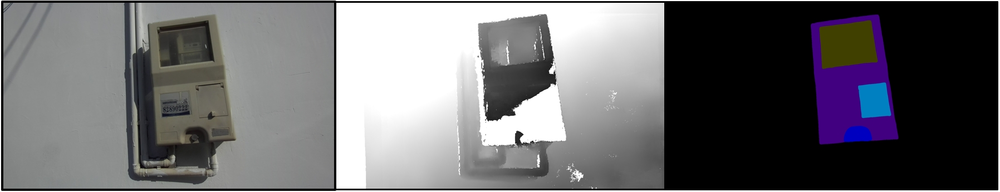

# <p align=center>`How to apply DFormer to new dataset`</p>


> If there are some questions or suggestions, please raise an issue or contact us at bowenyin@mail.nankai.edu.cn.

Acknowledgment to [wuYwen1](https://github.com/wuYwen1), he apply the DFormer to his own dataset and discuss with us about how to achieve the application to new datasets. 
The segmentation results are shown in the below:

<p align="center">
     <br />
    <em> 
    </em>
</p>

## 1. 🌟  Prepare your own data

If your dataset not contain the label, it is suggested to use [labelme](https://github.com/wkentaro/labelme) to label the data.

We recommond to orginize the dataset as follows:


```shell
<datasets>
|-- <DatasetName1>
    |-- <RGB>
        |-- <name1>.<ImageFormat>
        |-- <name2>.<ImageFormat>
        ...
    |-- <Depth>
        |-- <name1>.<DepthFormat>
    |-- <Label>
        |-- <name1>.<LabelFormat>
    |-- train.txt
    |-- test.txt
```

where the \<Format\> tends to be jpg or png, the two `.txt' files are used to index the training and evaluating sets.
<!-- We provide a [template]() to generate the indexing files. -->
The format of the indexing files (test.txt, train.txt) are as follows:

```shell
RGB/file1_name.<format>
```

Note that we assume that the depth, RGB, and label for the same sample share the name and are in different folders.


>Requirement: Depth maps and labels are gray images while RGB images are in RGB format.
In depth maps, the closer it is, the darker it is, and the farther it is, the whiter it is, i.e., 0 (nearest) to 255 (farest).
In labels, the 0 is the background class, which is not used to caluculate the loss, and 1-N means the N classes. If you want to caluculate the loss and miou on the background class, you can add 1 on the labels or delete the gt_transform within the `utils/dataloader/RGBXDataset.py' and then the class number is N+1 instead of N.


## 2. 🌟 Make your own config file

We provide a config template file at `local_configs\template\DFormer_Large.py'.

(1) replace the dataset_name with the name and folder name of your own data.

>C.dataset_name = 'dataset_name'  <br />
C.dataset_path = osp.join(C.root_dir, 'dataset_name')

(2) Change the format for rgb, depth and label.

>C.rgb_format = '.jpg' <br />
C.x_format = '.png' <br />
C.gt_format = '.png'

(3) Change the samples number according to the new dataset.

>C.num_train_imgs = None <br />
C.num_eval_imgs = None

(4) Set the classes number.

>C.num_classes = N <br />
C.class_names =  []

(5) Change the training size.

>C.image_height = 480 <br />
C.image_width = 640

You can also tune some other parameters for better performance.

After doing all the above operations, you can train DFormer on your own datasets by changing the config path within the `.sh' files.
